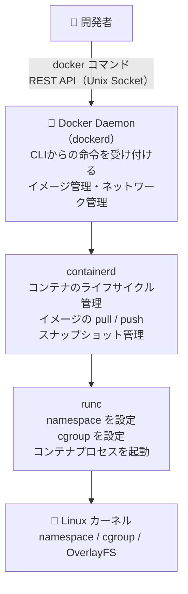
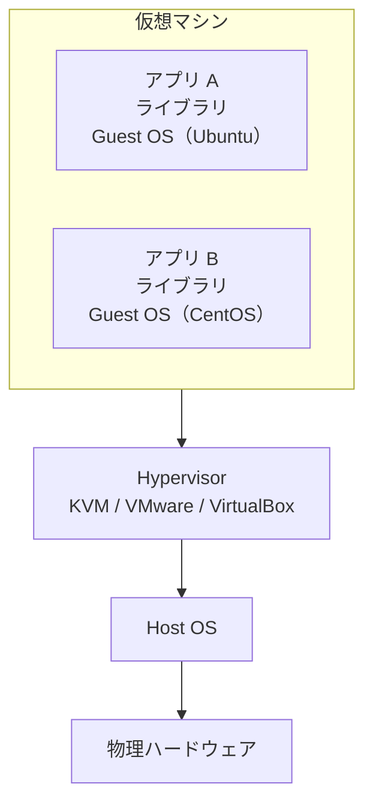
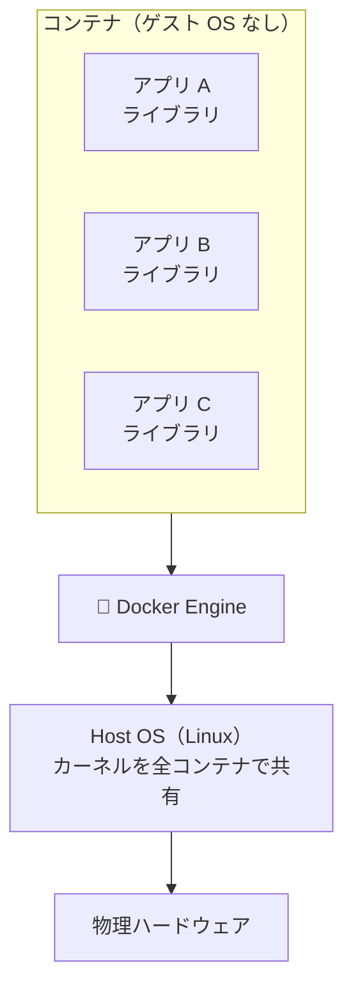
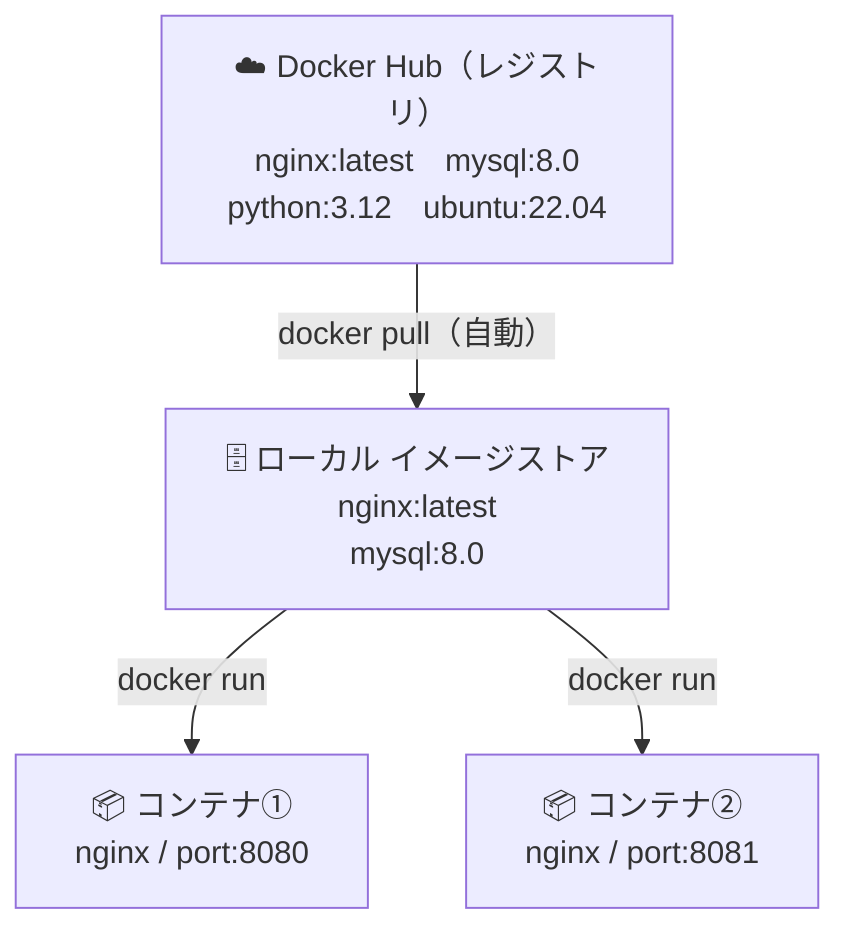
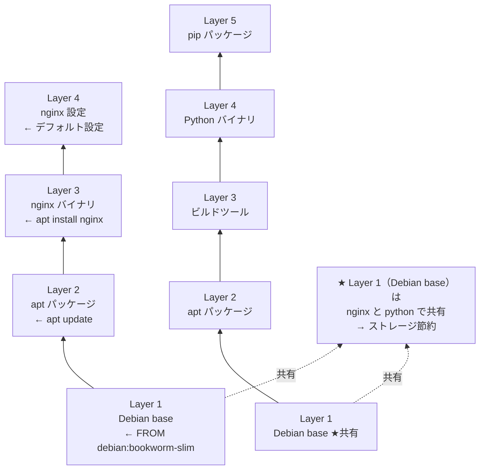
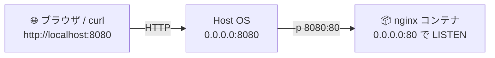
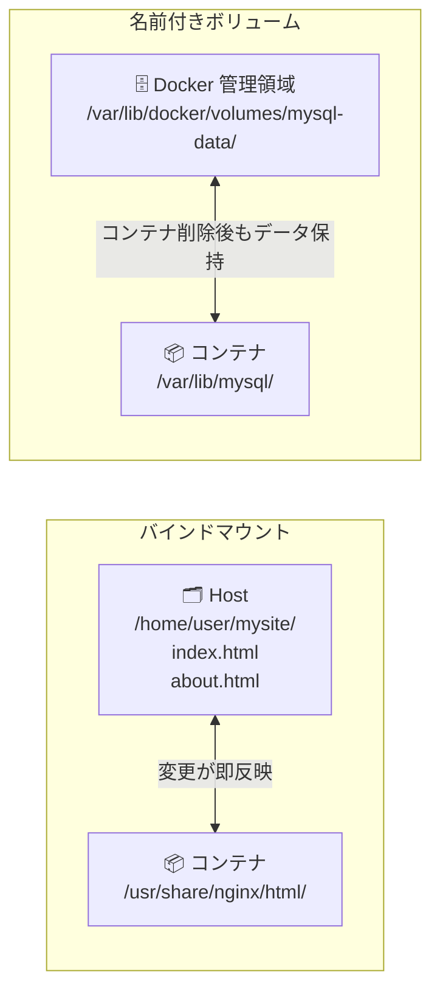
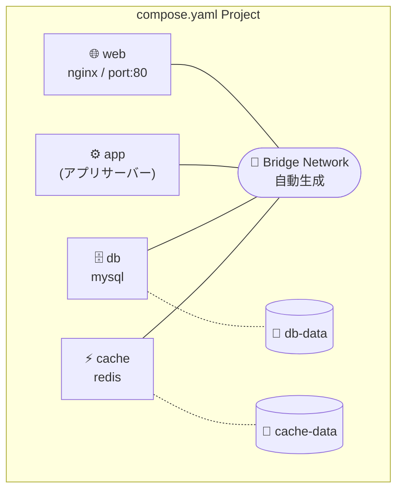
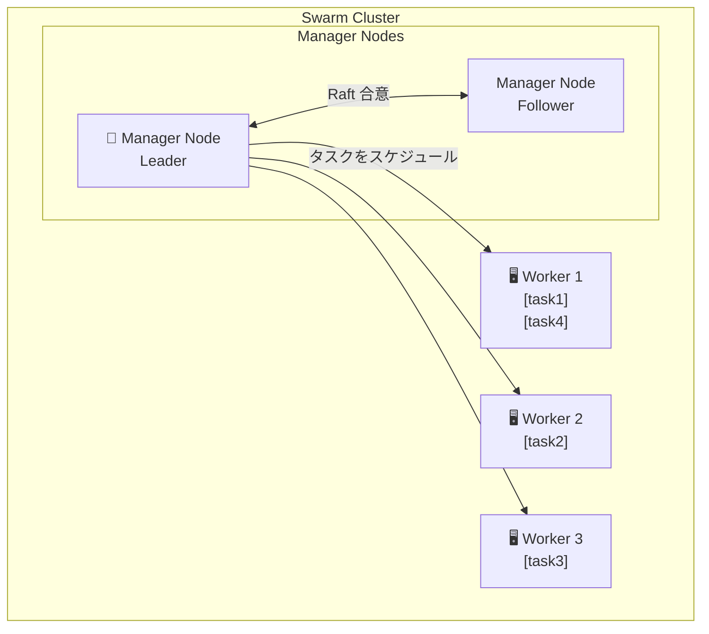
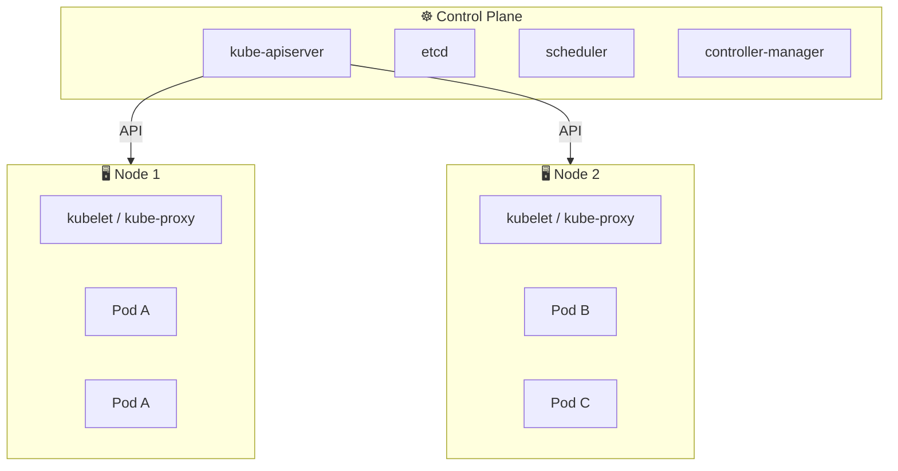

# アーキテクチャ図集

各 Phase の構成を図でまとめています。

---

## Phase 1：Docker Engine の構造

---

## Phase 1：VM vs コンテナ

### 仮想マシン

### コンテナ

---

## Phase 1：イメージ・コンテナ・レジストリの関係

> 同じイメージから複数のコンテナを起動できる

---

## Phase 1：レイヤー構造

---

## Phase 1：ポートマッピング

---

## Phase 1：ボリュームマウント

---

## Phase 3：Docker Compose 構成例

---

## Phase 4：Docker Swarm クラスタ

---

## Phase 5：Kubernetes アーキテクチャ

