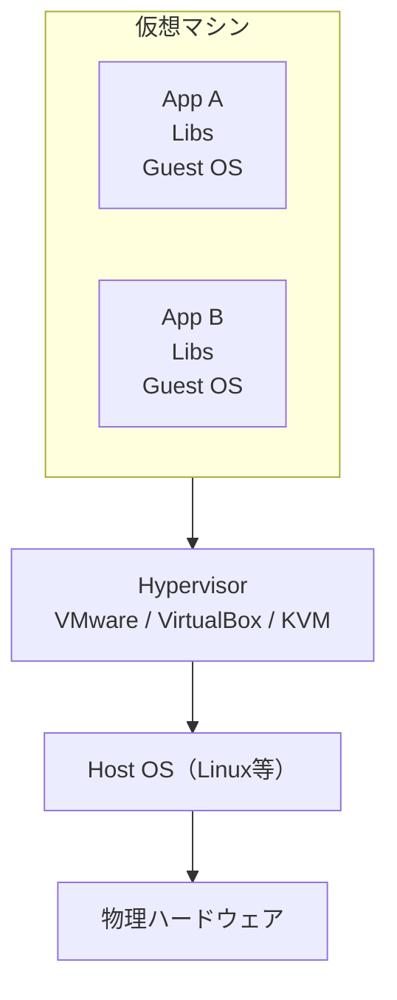
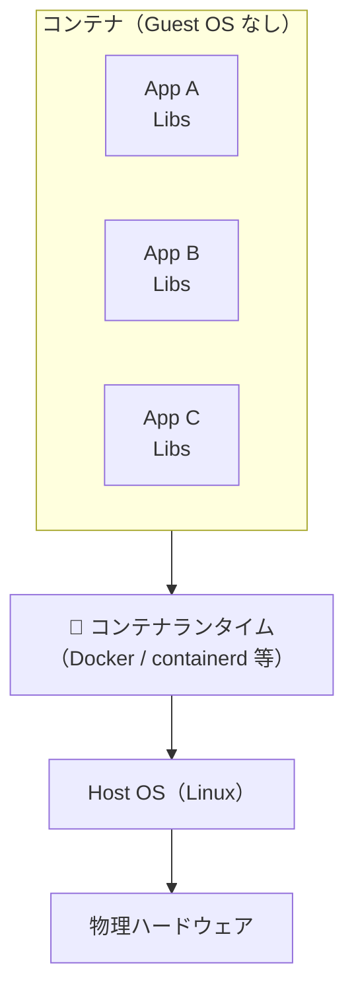
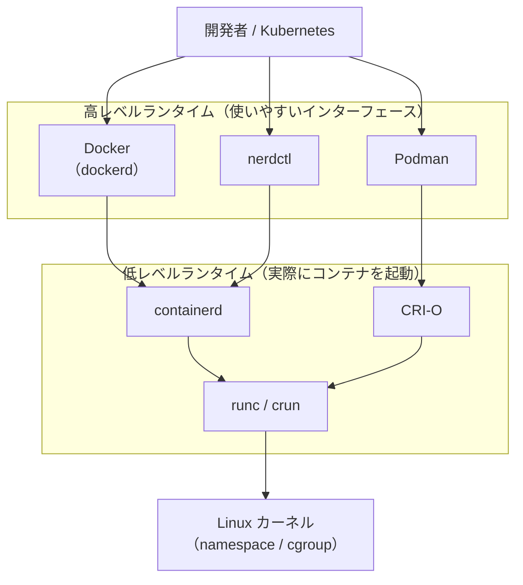

# 1-1. なぜコンテナなのか

## 🎯 このユニットのゴール

- VM とコンテナのアーキテクチャの違いを説明できる
- Linux の namespace / cgroup がコンテナの基盤であることを理解する
- Docker Engine の構成要素を把握する
- Docker 以外のコンテナランタイム（containerd・Podman）の役割を説明できる

---

## シナリオ

> あなたは社内の開発チームに所属するエンジニア。  
> 「開発環境が人によって違いすぎてバグの再現ができない」という問題が起きている。  
> チームリーダーから「Docker で環境を統一してほしい」と依頼が来た。  
> まず **なぜ Docker なのか** を理解するところから始めよう。

---

## 1. 「環境差異」問題とコンテナの登場

開発現場でよく聞く声：

- 「自分のマシンでは動くのに、本番で動かない」
- 「Python のバージョンが人によって違う」
- 「ライブラリを入れたら別のアプリが壊れた」

これらはすべて **環境の再現性** の問題。コンテナはこの問題を根本から解決する。

### なぜ今まで解決できなかったのか

従来の解決策とその限界：

| 手段 | 問題点 |
|---|---|
| README に手順を書く | 手順が古くなる・OS 差異が埋まらない |
| 仮想マシン（VM） | 重い・起動が遅い・共有しにくい |
| Ansible / Chef | インフラ寄りで開発者には難しい |

コンテナは「アプリとその依存ライブラリをまるごとパッケージ化」することで、どこでも同じ環境を再現できるようにした。

---

## 2. VM とコンテナのアーキテクチャ比較

### 仮想マシン（VM）



- **Hypervisor** が CPU・メモリ・ストレージを仮想化
- 各 VM は独立した **Guest OS** を丸ごと持つ → サイズが大きい・起動が遅い
- OS レベルで完全隔離されているため、セキュリティ強度は高い

### コンテナ



- Host OS の **Linux カーネルを共有**（Guest OS 不要）
- namespace / cgroup で「隔離されているように見せる」
- 軽量・高速・ポータブル

### 比較表

| 項目 | VM | コンテナ |
|---|---|---|
| 起動時間 | 分単位 | 秒以下 |
| サイズ | GB 単位 | MB 単位 |
| OS | ゲスト OS を各自保持 | ホスト OS のカーネルを共有 |
| 隔離レベル | 強い（ハードウェアレベル） | 中程度（プロセスレベル） |
| オーバーヘッド | 大きい | 小さい |
| 用途 | 異なる OS が必要な場合など | アプリの配布・実行環境の統一 |

> **LPIC との接続**  
> コンテナはあくまで「隔離されたプロセス」に過ぎない。  
> 実際に確かめてみよう。
>
> ```bash
> # ホスト側で nginx コンテナを起動
> docker run -d --name test-nginx nginx
>
> # ホスト側から ps で見ると、コンテナ内のプロセスが普通に見える
> ps aux | grep nginx
> # root  12345  nginx: master process
> # www   12346  nginx: worker process
>
> # コンテナの中に入って ps を実行すると…
> docker exec -it test-nginx bash
> ps aux
> # PID 1 が nginx になっている（ホストでは 12345 だったのに）
> # しかも nginx 以外のプロセスは何も見えない
> ```
>
> ホスト側では PID 12345 のただのプロセスなのに、コンテナの中では PID 1 に見える。  
> これが **namespace による隔離** の正体。`ps` や `kill` など LPIC で学んだコマンドがそのまま使える。

---

## 3. コンテナを支える Linux 技術

### 📖 用語：namespace（名前空間）

> プロセスが「見える世界」を分離する Linux カーネルの機能。

コンテナは以下の namespace を使って隔離を実現している：

| namespace | 分離するもの | 具体例 |
|---|---|---|
| `pid` | プロセス ID | コンテナ内では PID 1 から始まる |
| `net` | ネットワークインターフェース・ルーティング | コンテナごとに独立した eth0 を持つ |
| `mnt` | マウントポイント（ファイルシステムの見え方） | コンテナは `/` から独自のファイルツリーを見る |
| `uts` | ホスト名・ドメイン名 | `hostname` コマンドの結果がコンテナごとに異なる |
| `ipc` | プロセス間通信（共有メモリ・メッセージキュー） | 別コンテナのプロセスと IPC できない |
| `user` | ユーザー ID・グループ ID | コンテナ内の root がホストの root と別になる |

```bash
# コンテナ内で確認するとプロセスが隔離されているのがわかる
# （1-2 のハンズオンで実際に試す）
ps aux
```

namespace はカーネルが提供する機能なので、Docker なしでも `unshare` コマンドで試せる：

```bash
# pid namespace だけを分離した新しいシェルを起動（参考）
sudo unshare --pid --fork --mount-proc bash
ps aux  # このシェルの中では bash が PID 1 に見える
```

### 📖 用語：cgroup（コントロールグループ）

> プロセスグループのリソース（CPU・メモリ・I/O）を制限・計測する Linux カーネルの機能。

コンテナに「CPU は 1 コアまで」「メモリは 512MB まで」といった制限をかける仕組み。

```bash
# cgroup の実体はファイルシステム上に存在する（LPIC で学んだ /sys 以下）
ls /sys/fs/cgroup/

# Docker が作った cgroup の例
cat /sys/fs/cgroup/memory/docker/<コンテナID>/memory.limit_in_bytes
```

コンテナに制限をつけて起動する例：

```bash
# メモリ上限 256MB、CPU 使用を 0.5 コア相当に制限
docker run -m 256m --cpus="0.5" nginx
```

> **まとめ**  
> コンテナ ＝ namespace による隔離 ＋ cgroup によるリソース制限  
> Docker はこれらを使いやすくラップしたツール。

---

## 4. Docker Engine の構造

Docker を使うとき、裏側では複数のコンポーネントが連携している。

```
Docker CLI（docker コマンド）
    ↓ REST API (Unix socket: /var/run/docker.sock)
Docker Daemon（dockerd）
    ↓ gRPC
containerd（コンテナライフサイクル管理）
    ↓
containerd-shim（コンテナプロセスの橋渡し）
    ↓
runc（実際に namespace/cgroup を操作してコンテナを起動）
    ↓
Linux カーネル（namespace / cgroup）
```

### 📖 用語：Docker Daemon（dockerd）

> バックグラウンドで動き続けるサーバープロセス。CLI からの命令を受け取り、コンテナを管理する。

- `/var/run/docker.sock` という Unix ソケットで CLI と通信
- イメージのビルド・プル・ネットワーク管理などの高レベル機能を担当
- `dockerd` が落ちても、すでに動いているコンテナは containerd が管理するため止まらない

### 📖 用語：containerd

> コンテナのライフサイクル（起動・停止・イメージ管理）を担うコンポーネント。  
> Docker から独立しており、Kubernetes もこれを直接利用している。

- 元は Docker の内部コンポーネントだったが、2017 年に CNCF へ寄贈・独立
- イメージの pull / push、コンテナの起動・停止・一時停止を管理
- **Kubernetes は 1.24 以降、Docker を経由せず containerd を直接使用**

```bash
# containerd が動いているか確認
systemctl status containerd

# containerd 付属の CLI（nerdctl）でコンテナ操作
nerdctl run -d nginx
```

### 📖 用語：runc

> OCI（Open Container Initiative）仕様に準拠した低レベルのコンテナランタイム。  
> 実際に Linux の namespace/cgroup を操作してコンテナを起動する。

- `fork()`・`exec()` でプロセスを生成し、namespace・cgroup を設定する
- OCI 仕様に準拠しているため、containerd 以外のランタイムも runc を使える
- コンテナ起動後は `containerd-shim` が子プロセスを監視する

### 📖 用語：OCI（Open Container Initiative）

> コンテナのイメージ形式・ランタイムの仕様を標準化する団体と仕様群。

| 仕様 | 内容 |
|---|---|
| Image Spec | コンテナイメージのフォーマット |
| Runtime Spec | コンテナの起動・停止方法 |
| Distribution Spec | レジストリとのやりとり（push/pull） |

OCI 仕様があるおかげで「Docker でビルドしたイメージを Podman で動かす」ことが可能。

---

## 5. Docker 以外のコンテナランタイム

コンテナ技術は Docker だけではない。用途や環境によって使い分けられる複数のランタイムが存在する。



### Docker

**「コンテナを普及させた立役者」**

- 2013 年登場。コンテナを一般開発者でも使えるようにした
- `Dockerfile` でイメージをビルドし、`docker run` で起動するワークフローを確立
- **daemon（デーモン）あり**：`dockerd` が常時起動しており、CLI はそれに命令を送る
- Docker Desktop（Mac/Windows 向け）を使えば Linux VM なしでも動作

```bash
# Docker の基本操作
docker build -t myapp .
docker run -d -p 8080:80 myapp
docker ps
docker logs <container_id>
```

**主な用途**：開発環境の統一・CI/CD・個人プロジェクト

---

### containerd

**「Kubernetes の標準コンテナランタイム」**

- Docker の内部コンポーネントとして生まれ、2017 年に CNCF へ独立
- Kubernetes は 1.20 で Docker を非推奨化し、1.24 以降は **containerd を直接利用**
- 直接操作する CLI として `nerdctl`（Docker 互換）や `ctr`（低レベル）がある

```bash
# nerdctl（Docker 互換 CLI）で操作
nerdctl run -d -p 8080:80 nginx
nerdctl ps
nerdctl images

# Kubernetes クラスタで使用中の containerd を確認
kubectl get nodes -o wide
# CONTAINER-RUNTIME 列に containerd://x.x.x と表示される
```

**主な用途**：Kubernetes の基盤・本番クラスタ

---

### Podman

**「デーモンレス・rootless コンテナ」**

- Red Hat が開発・OSSとして公開。RHEL / Fedora / CentOS のデフォルトツール
- **daemon なし（daemonless）**：`docker run` のようにコマンドを打つとその場でコンテナを起動
  - セキュリティリスクになりうる「常時起動のデーモン」が不要
- **rootless モード**：root 権限なしでコンテナを起動できる（セキュリティ強化）
- Docker CLI と高い互換性があり、エイリアスで置き換えやすい

```bash
# Docker と同じ感覚で使える
podman run -d -p 8080:80 nginx
podman ps
podman images

# rootless（一般ユーザーのまま）でコンテナを起動
whoami  # → 一般ユーザー
podman run --rm alpine echo "rootless container!"

# Docker Compose 相当の機能
podman-compose up -d
```

**主な用途**：セキュリティ重視の本番環境・RHEL 系 Linux・CI/CD

---

### ランタイム比較表

| 項目 | Docker | containerd | Podman |
|---|---|---|---|
| デーモン | あり（dockerd） | あり | **なし（daemonless）** |
| rootless | 設定が必要 | 設定が必要 | **デフォルトで対応** |
| Kubernetes 連携 | Docker shim（非推奨） | **ネイティブ対応（CRI）** | CRI-O 経由 |
| イメージ形式 | OCI / Docker 形式 | OCI 形式 | OCI 形式 |
| 主な使用場面 | 開発環境・CI | Kubernetes 本番 | RHEL 系・セキュア環境 |
| CLIの互換性 | 基準 | nerdctl で互換 | **Docker CLI と高互換** |
| 開発元 | Docker Inc. | CNCF | Red Hat |

> **ポイント**  
> どのランタイムを使っても、中身は同じ **OCI イメージ** と **Linux カーネルの namespace/cgroup**。  
> 「Docker で作ったイメージを Podman で動かす」「Kubernetes（containerd）で動かす」が普通にできる。

---

## ✅ 振り返りチェックリスト

- [ ] VM とコンテナの起動時間・サイズ・OS 共有の違いを説明できる
- [ ] namespace がプロセスの隔離に使われることを説明できる
- [ ] cgroup がリソース制限に使われることを説明できる
- [ ] `dockerd → containerd → runc` の流れを図示できる
- [ ] OCI 仕様がコンテナの相互運用性を保証することを説明できる
- [ ] Docker・containerd・Podman それぞれの特徴と使い分けを説明できる

---

## 次のユニット

[1-2. インストールとはじめの一歩](./1-2_install-and-first-run.md)
