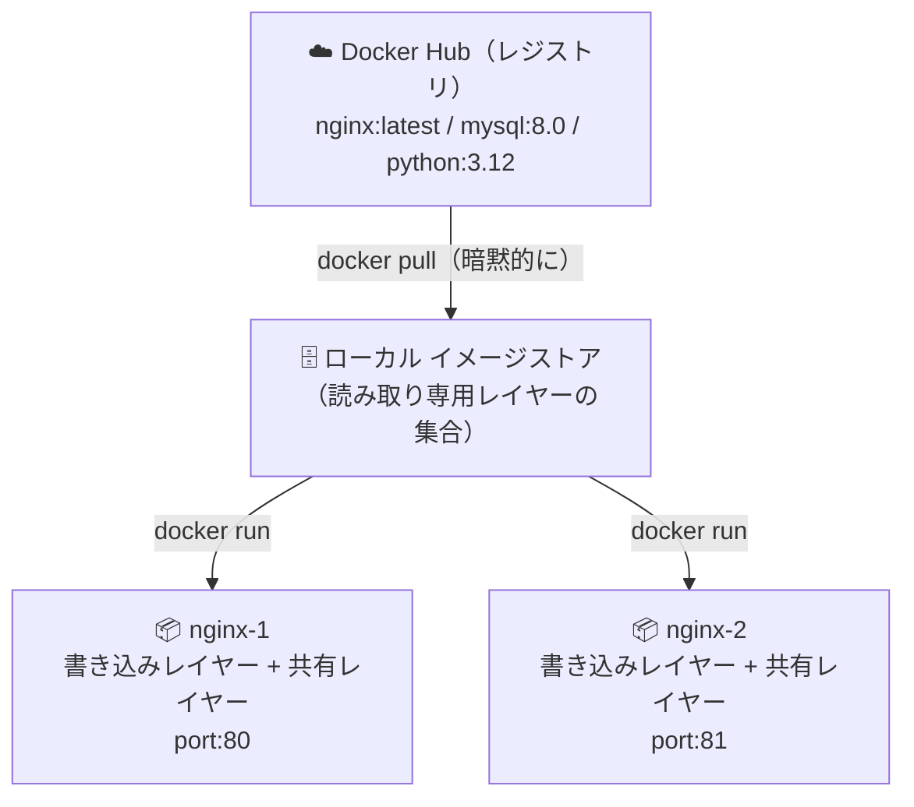

# 1-2. インストールとはじめの一歩

## 🎯 このユニットのゴール

- Docker Engine をインストールできる
- `docker run hello-world` を実行し、裏側の流れを説明できる
- イメージ・コンテナ・レジストリ・レイヤーの関係を図で説明できる
- Union FS（オーバーレイファイルシステム）の仕組みを説明できる

---

## シナリオ

> さっそくローカルに Docker をインストールして、最初のコンテナを動かしてみよう。  
> 「動いた！」で終わらず、**裏で何が起きているか** を追うのがこのユニットのポイント。

---

## 1. Docker Engine のインストール

### Ubuntu の場合（推奨環境）

```bash
# 古いバージョンの削除
sudo apt remove docker docker-engine docker.io containerd runc 2>/dev/null

# 必要なパッケージの取得
sudo apt update
sudo apt install -y ca-certificates curl gnupg

# Docker の公式 GPG キーを追加
sudo install -m 0755 -d /etc/apt/keyrings
curl -fsSL https://download.docker.com/linux/ubuntu/gpg | \
  sudo gpg --dearmor -o /etc/apt/keyrings/docker.gpg
sudo chmod a+r /etc/apt/keyrings/docker.gpg

# リポジトリを追加
echo \
  "deb [arch=$(dpkg --print-architecture) signed-by=/etc/apt/keyrings/docker.gpg] \
  https://download.docker.com/linux/ubuntu \
  $(. /etc/os-release && echo "$VERSION_CODENAME") stable" | \
  sudo tee /etc/apt/sources.list.d/docker.list > /dev/null

# インストール
sudo apt update
sudo apt install -y docker-ce docker-ce-cli containerd.io docker-buildx-plugin docker-compose-plugin
```

### インストール確認

```bash
sudo docker version
# Client と Server 両方表示されれば OK

sudo systemctl status docker
# Active: active (running) であることを確認
```

### sudo なしで使えるようにする

```bash
# 現在のユーザーを docker グループに追加
sudo usermod -aG docker $USER

# 一度ログアウト＆ログインして反映
# 確認
docker version
```

> **⚠️ セキュリティメモ**  
> `docker` グループへの追加は実質的に root 権限と同等。  
> 本番サーバーでの扱いには注意が必要。rootless モード（Podman や rootless Docker）が推奨される。

### Windows / Mac の場合（Docker Desktop）

| 環境 | インストール方法 |
|---|---|
| Windows | Docker Desktop をインストール → WSL2 バックエンドを有効化 |
| Mac（Intel） | Docker Desktop dmg をインストール |
| Mac（Apple Silicon） | Docker Desktop の ARM 版をインストール |

**WSL2（Windows Subsystem for Linux 2）との連携：**

```powershell
# PowerShell で WSL2 を有効化
wsl --install

# Docker Desktop の設定 → Resources → WSL Integration で
# 使用する WSL ディストリビューションを有効化する
```

WSL2 内の Linux ターミナルからも `docker` コマンドが使えるようになる。

> **Docker Desktop vs Docker Engine の違い：**
>
> | | Docker Desktop | Docker Engine |
> |---|---|---|
> | 対象 | Mac / Windows | Linux |
> | GUI | あり | なし |
> | ライセンス | 商用利用は有料（条件あり） | 完全無料 |
> | 仕組み | Linux VM を内包して動かす | ネイティブに Linux 上で動く |

---

## 2. はじめてのコンテナ起動

```bash
docker run hello-world
```

### 出力例

```
Unable to find image 'hello-world:latest' locally
latest: Pulling from library/hello-world
c1ec31eb5944: Pull complete
Digest: sha256:xxxx...
Status: Downloaded newer image for hello-world:latest

Hello from Docker!
...
```

たった 1 行のコマンドで何が起きたのか、順を追って見ていこう。

---

## 3. `docker run` の裏側

```
①  docker run hello-world
       ↓
②  Docker CLI → dockerd へ「hello-world を実行して」と要求
       ↓ Unix socket (/var/run/docker.sock)
③  dockerd: ローカルに hello-world イメージがあるか確認
       → ない場合: Docker Hub からダウンロード（pull）
       ↓
④  containerd: イメージのレイヤーを展開
       ↓
⑤  runc: namespace/cgroup を設定してコンテナを起動
       → Hello from Docker! を出力して終了
       ↓
⑥  コンテナ停止（Exited 状態に）
```

```bash
# 現在のコンテナ一覧（停止中も含む）
docker ps -a

# CONTAINER ID   IMAGE         COMMAND    STATUS                    
# a1b2c3d4e5f6   hello-world   "/hello"   Exited (0) 5 seconds ago 
```

### ステップごとに手動で確認してみる

```bash
# pull だけする
docker pull nginx

# create だけ（起動しない）
docker create --name test-nginx nginx

# start で起動
docker start test-nginx

# 確認
docker ps

# 実は run = pull（必要時） + create + start を 1 コマンドでやってくれる
```

---

## 4. 主要用語の整理

### 📖 用語：イメージ（Image）

> コンテナの **設計図** となる読み取り専用のテンプレート。  
> アプリ・ライブラリ・設定ファイルをまとめたもの。

- `docker images` で一覧確認
- `docker pull <イメージ名>` でダウンロード
- `docker rmi <イメージ名>` で削除

### 📖 用語：コンテナ（Container）

> イメージを実体化して **実行中の状態** にしたもの。  
> イメージ（設計図）から何個でも作れる。

```
イメージ（hello-world）
    ├── コンテナ A（起動・停止・削除できる）
    ├── コンテナ B
    └── コンテナ C
```

### 📖 用語：レジストリ（Registry）

> イメージを保存・配布するサーバー。  
> デフォルトは **Docker Hub**（`hub.docker.com`）。  
> 企業では社内にプライベートレジストリを立てることも多い。

主要なレジストリ：

| レジストリ | 説明 |
|---|---|
| Docker Hub | `docker.io` — Docker 公式、最大のパブリックレジストリ |
| GHCR | `ghcr.io` — GitHub Container Registry |
| ECR | `xxx.dkr.ecr.*.amazonaws.com` — AWS |
| GCR | `gcr.io` — Google Cloud |
| ACR | `xxx.azurecr.io` — Azure |

```
[Docker Hub]
    library/nginx:latest
    library/mysql:8.0
    library/python:3.12
    mycompany/myapp:v1.0  ← 自分でpushしたもの
```

### 📖 用語：レイヤー（Layer）

> イメージは複数の **差分レイヤー** を積み重ねた構造になっている。  
> 同じレイヤーは複数のイメージで共有されるためディスクを節約できる。

```bash
# イメージのレイヤー構造を確認
docker image inspect hello-world
docker history nginx
```

```
nginx イメージ（例）
│
├── Layer 4: nginx の設定ファイル追加
├── Layer 3: nginx バイナリインストール
├── Layer 2: apt パッケージリスト更新
└── Layer 1: Debian ベースイメージ  ← 他のイメージと共有
```

---

## 5. Union FS（ユニオンファイルシステム）

### 📖 用語：Union FS / OverlayFS

> 複数の読み取り専用レイヤーを重ねて、1 つのファイルシステムとして見せる仕組み。  
> Docker はこれを使ってイメージレイヤーを実現している。

```
コンテナ実行時のファイルシステム:

┌──────────────────────────────┐
│ 書き込み可能レイヤー（薄い）   │ ← コンテナが変更したファイルだけここに書かれる
├──────────────────────────────┤
│ Layer 4（読み取り専用）        │
├──────────────────────────────┤
│ Layer 3（読み取り専用）        │
├──────────────────────────────┤
│ Layer 2（読み取り専用）        │
├──────────────────────────────┤
│ Layer 1（読み取り専用）        │ ← 複数のイメージで共有
└──────────────────────────────┘

コンテナを削除すると「書き込み可能レイヤー」だけが消える
→ イメージ（読み取り専用レイヤー）は残る
```

```bash
# OverlayFS の実体を確認
docker inspect nginx | grep -A10 "GraphDriver"
# "LowerDir": "/var/lib/docker/overlay2/.../diff:..."  ← 読み取り専用レイヤー群
# "UpperDir": "/var/lib/docker/overlay2/.../diff"      ← 書き込みレイヤー
# "MergedDir": "/var/lib/docker/overlay2/.../merged"   ← 統合されたビュー
```

> **LPIC との接続：**  
> `/proc` や `/sys` と同様、OverlayFS も「ファイルとして見えるが実態は違う」Linux の考え方。  
> カーネルの `overlay` モジュールを使っており、`lsmod | grep overlay` で確認できる。

---

## 6. イメージ・コンテナ・レジストリの関係図



---

## 7. よく使う確認コマンド

```bash
# ローカルのイメージ一覧
docker images

# 実行中のコンテナ一覧
docker ps

# 停止中も含む全コンテナ
docker ps -a

# Dockerの全体的な情報（ストレージ使用量など）
docker info
# 特に見るべき項目:
# Server Version: Docker のバージョン
# Storage Driver: overlay2（推奨）
# Docker Root Dir: /var/lib/docker（イメージが保存される場所）
# Containers: 3 (Running: 1, Paused: 0, Stopped: 2)
# Images: 5

# ディスク使用量（詳細内訳）
docker system df
# TYPE            TOTAL     ACTIVE    SIZE      RECLAIMABLE
# Images          5         1         823MB     640MB (77%)
# Containers      3         1         1.2kB     800B (66%)
# Local Volumes   2         1         456MB     0B (0%)
# Build Cache     10        0         234MB     234MB
```

### `docker info` で確認すべき項目

```bash
docker info | grep -E "Driver|Version|Namespace|Cgroup"
# Storage Driver: overlay2          ← ファイルシステムドライバ
# Cgroup Driver: systemd            ← cgroup 管理方式
# Cgroup Version: 2                 ← cgroup v2（最新）
# Default Runtime: runc             ← 低レベルランタイム
```

---

## ✅ 振り返りチェックリスト

- [ ] `docker run` を実行したときの 6 ステップを説明できる
- [ ] イメージとコンテナの違いを「設計図と実体」で説明できる
- [ ] レジストリがイメージの置き場であることを説明できる
- [ ] レイヤー構造のメリット（共有によるディスク節約）を説明できる
- [ ] Union FS / OverlayFS がなぜ「書き込みレイヤーだけ消える」のかを説明できる
- [ ] `docker ps -a` と `docker images` の出力を読める
- [ ] `docker system df` でディスク使用量を確認できる

---

## 次のユニット

[1-3. コンテナ操作の基本](./1-3_container-basics.md)
