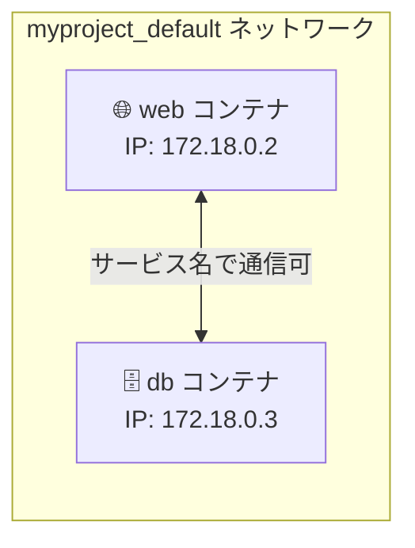

# 3-3. ネットワークとボリューム

## 🎯 このユニットのゴール

- Compose が自動生成するネットワークの仕組みを説明できる
- サービス名で名前解決できる理由を理解できる
- ネットワークドライバの種類と使い分けを説明できる
- 複数の Compose プロジェクト間でネットワーク・ボリュームを共有できる

---

## シナリオ

> Web サービスが DB に接続するとき、IP アドレスを直書きすると再起動のたびに変わってしまう。  
> Compose のネットワーク機能を使って「サービス名で繋がる」仕組みを理解しよう。

---

## 1. Compose が自動生成するネットワーク

`docker compose up` を実行すると、Compose は自動でブリッジネットワークを作成する。

```bash
docker compose up -d
docker network ls
# NAME                    DRIVER   SCOPE
# compose-hello_default   bridge   local   ← 自動生成
```

### 📖 用語：ブリッジネットワーク（Bridge Network）

> Docker が作成する仮想スイッチ。同じネットワークに接続されたコンテナ同士は通信できる。  
> Compose は全サービスを自動的に同じネットワークに接続する。



---

## 2. サービス名での名前解決

### 📖 用語：サービスディスカバリ（Service Discovery）

> コンテナが「相手の IP アドレスを知らなくてもサービス名で通信できる」仕組み。  
> Compose ネットワーク内では **サービス名が DNS ホスト名** として自動登録される。

```yaml
services:
  web:
    build: .
    environment:
      # IP アドレスではなく "db" というサービス名で指定できる
      DATABASE_URL: mysql://root:secret@db/myapp
      #                                  ↑ compose.yaml のサービス名

  db:
    image: mysql:8.0
```

```bash
# web コンテナの中から db に ping できる
docker compose exec web ping db
# PING db (172.18.0.3): 56 data bytes
# コンテナの IP は起動のたびに変わるが、名前で解決されるので問題ない

# 名前解決の確認
docker compose exec web nslookup db
# Server: 127.0.0.11   ← Docker の組み込み DNS
# Address: 127.0.0.11#53
# Name: db
# Address: 172.18.0.3
```

> **LPIC との接続：**  
> `/etc/hosts` や `/etc/resolv.conf` の仕組みをそのまま応用している。
>
> ```bash
> # コンテナ内の /etc/resolv.conf を確認
> docker compose exec web cat /etc/resolv.conf
> # nameserver 127.0.0.11   ← Docker が提供する DNS サーバー
> # search myproject_default  ← Compose ネットワーク名
>
> # このDNSが "db" という名前を IP に解決してくれる
> # Linux でいう /etc/hosts に自動でエントリが追加されるイメージ
> ```

---

## 3. ネットワークドライバの種類

Compose で使えるネットワークドライバ：

| ドライバ | 説明 | 用途 |
|---|---|---|
| `bridge`（デフォルト） | 仮想ブリッジを作成。同じホスト上のコンテナ間通信 | 通常の Compose |
| `host` | ホストのネットワークをそのまま使う | パフォーマンス優先時 |
| `none` | ネットワークなし（完全隔離） | セキュリティ重視 |
| `overlay` | 複数ホスト間をまたぐネットワーク | Docker Swarm 用 |
| `macvlan` | コンテナに物理 NIC の MAC アドレスを割り当て | ネットワーク機器との直接通信 |

```yaml
# ネットワークドライバを指定
networks:
  mynet:
    driver: bridge
    driver_opts:
      com.docker.network.bridge.name: "custom-bridge"   # ブリッジ名を指定
    ipam:
      config:
        - subnet: 192.168.100.0/24   # IP レンジを指定
          gateway: 192.168.100.1
```

---

## 4. ネットワークの分離

すべてのサービスを同じネットワークに入れたくない場合は、ネットワークを分けられる：

```yaml
# 例: フロント / バック / DB を分離する3層構成
services:
  frontend:
    image: nginx
    networks:
      - front-net       # フロント層のみ

  backend:
    build: .
    networks:
      - front-net       # フロントからアクセスできる
      - back-net        # DB にもアクセスできる

  db:
    image: mysql:8.0
    networks:
      - back-net        # バックエンドからのみアクセス可能

networks:
  front-net:
  back-net:
```

```
インターネット
      ↓
  frontend (front-net のみ)
      ↓ front-net
  backend (front-net + back-net)
      ↓ back-net
    db (back-net のみ)
```

> **セキュリティ上の意味：** db コンテナは front-net に繋がっていないので、  
> frontend から直接 DB に接続することができない。  
> XSS などで frontend が乗っ取られても DB への直接アクセスを防げる。

```bash
# ネットワーク分離を確認
# frontend から db に直接 ping できないことを確認
docker compose exec frontend ping db
# ping: bad address 'db'  ← front-net に db がいないので解決できない

# backend からは db に繋がる
docker compose exec backend ping db
# PING db (172.20.0.3) ...
```

---

## 5. Compose のボリューム管理

### 名前付きボリュームの宣言

```yaml
services:
  db:
    image: mysql:8.0
    volumes:
      - db-data:/var/lib/mysql

  redis:
    image: redis:7
    volumes:
      - redis-data:/data
      - ./redis.conf:/etc/redis/redis.conf:ro   # 設定ファイルのバインドマウント

# トップレベルで宣言が必要
volumes:
  db-data:
    driver: local             # デフォルト
    driver_opts:
      type: none
      o: bind
      device: /data/mysql     # ホストのパスを指定（特定のディスクに置く場合）
  redis-data:
```

```bash
# ボリュームの確認（プロジェクト名がプレフィックスになる）
docker volume ls
# DRIVER   VOLUME NAME
# local    myproject_db-data
# local    myproject_redis-data

# コンテナを停止しても保持される
docker compose down
docker volume ls   # まだある

# ボリュームごと削除
docker compose down -v
docker volume ls   # なくなった
```

### バインドマウントのオプション

```yaml
volumes:
  # 基本形
  - ./src:/app

  # 読み取り専用
  - ./config:/app/config:ro

  # 長い記法（より明示的）
  - type: bind
    source: ./src
    target: /app
    read_only: false

  # selinux ラベル（SELinux 環境での権限問題を解決）
  - ./data:/app/data:z   # z = shared, Z = private
```

### tmpfs（メモリ上の一時ボリューム）

```yaml
services:
  web:
    image: flask-app
    tmpfs:
      - /tmp              # /tmp をメモリ上に
      - /run:size=100m    # /run をメモリ上に（サイズ制限付き）
    # または volumes で指定
    volumes:
      - type: tmpfs
        target: /tmp
        tmpfs:
          size: 100000000   # 100MB
```

> **tmpfs の用途：**
> - 機密情報（セッショントークンなど）を一時的に扱う
> - 大量の一時ファイルを高速に処理する（ディスク I/O を避ける）
> - テスト用の一時データを格納する

---

## 6. 外部ボリューム（別プロジェクトと共有）

```yaml
volumes:
  shared-data:
    external: true   # Compose の外で作られたボリュームを参照
    name: mycompany_shared_volume
```

```bash
# 事前に共有ボリュームを作成しておく
docker volume create mycompany_shared_volume

# 複数の compose.yaml から同じボリュームを参照できる
```

---

## 7. 複数 Compose プロジェクト間の接続

別々の `compose.yaml` で管理するサービス同士を繋げたいケース：

```bash
# 例: frontend プロジェクトと backend プロジェクトが別ディレクトリにある
~/projects/
├── frontend/compose.yaml
└── backend/compose.yaml
```

```yaml
# backend/compose.yaml
networks:
  backend-net:
    name: shared_backend_net   # 固定の名前をつける

services:
  api:
    image: flask-api:latest
    networks:
      - backend-net
```

```yaml
# frontend/compose.yaml
networks:
  backend-net:
    external: true             # 外部ネットワークとして参照
    name: shared_backend_net

services:
  web:
    image: nginx:alpine
    networks:
      - backend-net
    # 同じネットワークにいるので "api" というサービス名で通信できる
```

```bash
# backend を先に起動
cd ~/projects/backend && docker compose up -d

# frontend を起動
cd ~/projects/frontend && docker compose up -d

# frontend から backend の api サービスに接続できる
docker compose -p frontend exec web curl http://api:5000/
```

---

## ✅ 振り返りチェックリスト

- [ ] Compose が自動でネットワークを作ることを説明できる
- [ ] サービス名で名前解決できる仕組み（Docker DNS: 127.0.0.11）を説明できる
- [ ] ネットワークを分けてサービスを隔離する方法を書ける
- [ ] bridge / host / none / overlay のネットワークドライバの違いを説明できる
- [ ] `docker compose down` と `docker compose down -v` の違いを説明できる
- [ ] `tmpfs` の用途（一時的な機密データ・高速 I/O）を説明できる
- [ ] `external: true` の使い方を説明できる

---

## 次のユニット

[3-4. シナリオ演習](./3-4_scenario.md)
