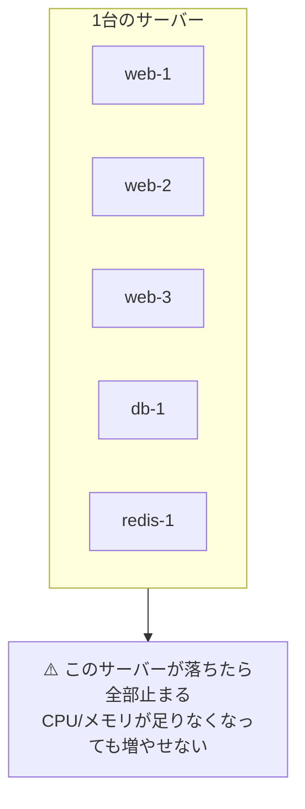
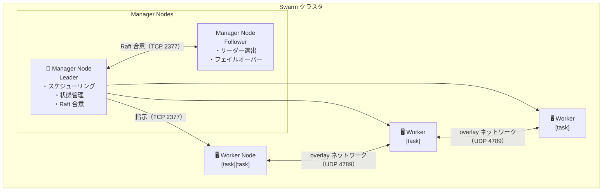

# 4-1. オーケストレーションと Swarm の概念

## 🎯 このユニットのゴール

- 単一ホストの限界とオーケストレーションの必要性を説明できる
- Swarm のアーキテクチャ（Manager / Worker / Task）を説明できる
- Overlay ネットワークと Routing Mesh の仕組みを説明できる
- Swarm と Kubernetes の使い分けを説明できる

---

## シナリオ

> Compose で動かしている Web アプリへのアクセスが増えてきた。  
> 「1 台のサーバーで動かす」構成の限界が見えてきた。  
> 複数サーバーに分散して、スケールアウトと自動復旧を実現しよう。

---

## 1. 単一ホストの限界

Compose は単一ホスト上のコンテナ管理には優れているが、こんな問題が起きる：



**必要になること：**
- 複数サーバーに分散してコンテナを実行したい（水平スケール）
- 1 台落ちても自動で別のサーバーでコンテナを再起動してほしい（高可用性）
- トラフィックが増えたらコンテナを増やしたい（スケールアウト）
- 新バージョンを無停止でリリースしたい（ローリングアップデート）

これらを解決するのが **オーケストレーション** だ。

---

## 2. Docker Swarm のアーキテクチャ

### 📖 用語：クラスタ（Cluster）

> 複数のサーバー（ノード）をひとつの論理的な単位としてまとめたもの。  
> Swarm ではクラスタ全体が「1 つの大きな Docker ホスト」のように振る舞う。



### 📖 用語：Manager ノード

> クラスタの頭脳。以下の役割を持つ：
> - ノードの管理（Worker の参加・離脱）
> - サービスのスケジューリング（どのノードでどのコンテナを動かすか）
> - 状態管理（desired state の維持）
> - Raft 合意形成（複数 Manager 間でリーダーを選出）

### 📖 用語：Worker ノード

> Manager の指示に従い、実際にコンテナ（タスク）を実行するノード。  
> Worker は Manager と `TCP 2377` で通信し、ノード間は `TCP/UDP 7946` を使う。

### 📖 用語：タスク（Task）

> Swarm の最小実行単位。コンテナ 1 つに相当する。  
> Service が「3 レプリカ欲しい」と指定すると、3 つのタスクが作成される。

### 📖 用語：desired state（望ましい状態）

> 「Web サービスを 3 台動かし続けたい」という**宣言的な定義**。  
> Swarm は常にこの状態になるよう自律的に動く。

```
desired state: web サービスを 3 レプリカ実行せよ

現実: worker-1 が落ちて 2 レプリカになった

Swarm の自動対応: worker-2 か worker-3 で新しいタスクを起動 → 3 レプリカに戻る
```

> **LPIC との接続：**  
> RAID や LVM と思想が似ている。
>
> ```
> RAID-1: "ディスクを 2 台ミラーリングして冗長化せよ"
>   → 1 台壊れても自動で継続（望ましい状態を維持）
>
> Swarm: "Web コンテナを 3 台動かし続けよ"
>   → 1 台落ちても自動でコンテナを再起動（望ましい状態を維持）
> ```
>
> 「コンテナ版 RAID」のような感覚で捉えると、自動復旧の概念が入りやすい。

---

## 3. Raft アルゴリズムと Manager の冗長化

### 📖 用語：Raft アルゴリズム

> 分散システムでの合意形成（誰がリーダーか）を行うアルゴリズム。  
> Manager が複数いる場合、Swarm は Raft でリーダーを選出する。

### 📖 用語：クォーラム（Quorum）

> クラスタが正常に動作するために必要な Manager の最低数。  
> **`(Manager 数 / 2) + 1`** で計算される。

| Manager 数 | クォーラム | 許容障害数 |
|---|---|---|
| 1 | 1 | 0（本番非推奨） |
| 3 | 2 | 1 |
| 5 | 3 | 2 |
| 7 | 4 | 3 |

```
Manager 3 台の場合：
- 3 台すべて正常 → 動作 ✅
- 1 台障害 → 残り 2 台でクォーラム達成 → 動作 ✅
- 2 台障害 → クォーラム未達 → スケジューリング停止 ❌
```

> **本番運用の推奨：** Manager は 3 台か 5 台。2 台は 1 台落ちるとクォーラム未達になるので NG。  
> Manager 数を増やしすぎると Raft の通信コストが増えるため、7 台以上は非推奨。

---

## 4. Overlay ネットワーク

### 📖 用語：Overlay ネットワーク

> 複数のホストにまたがるコンテナが、同じ仮想ネットワークにいるように通信できる仕組み。  
> VXLAN（Virtual Extensible LAN）プロトコルを使って、物理ネットワークの上に仮想ネットワークを構築する。

```
物理構成:
  node1 (192.168.0.1)  ←→ node2 (192.168.0.2)

Overlay ネットワーク（仮想）:
  node1 の web コンテナ (10.0.0.2)  ←→  node2 の web コンテナ (10.0.0.3)

実際の通信:
  node1 → UDP 4789（VXLAN） → node2 → 中のコンテナへ
```

```bash
# Swarm 初期化後、デフォルトで作られる overlay ネットワーク
docker network ls
# NAME              DRIVER    SCOPE
# ingress           overlay   swarm   ← Swarm の内部ルーティング用
# docker_gwbridge   bridge    local   ← コンテナとホスト間のゲートウェイ

# アプリ用の overlay ネットワークを作成
docker network create --driver overlay --attachable myapp-net

# サービス作成時に overlay を指定
docker service create --network myapp-net --name web nginx
```

---

## 5. Routing Mesh（ルーティングメッシュ）

### 📖 用語：Routing Mesh

> どのノードにリクエストが来ても、サービスを実行しているタスクへ自動的にルーティングする仕組み。  
> ノード上でタスクが動いていなくても、リクエストを受け取って転送できる。

```
外部クライアント → node3:8080 へリクエスト
                        ↓
         node3 上に web タスクが動いていない場合でも
                        ↓ Routing Mesh が転送
         node1:80 または node2:80（実際にタスクがあるノード）
                        ↓
                 ロードバランシングされる
```

```bash
# web サービスを node1, node2 だけで動かしていても、
# node3 へのリクエストも正しく処理される
docker service create \
  --name web \
  --publish published=8080,target=80 \
  --replicas 2 \
  nginx

# node3（タスクがないノード）にアクセスしても応答が返る
curl http://node3:8080   # → nginx の応答が返る
```

---

## 6. Swarm vs Kubernetes

| 観点 | Docker Swarm | Kubernetes（K8s） |
|---|---|---|
| 習得難易度 | 低い | 高い |
| セットアップ | 簡単（`docker swarm init` だけ） | 複雑（kubeadm/EKS/GKE） |
| 機能の豊富さ | 必要十分 | 非常に豊富 |
| エコシステム | 小さい | 非常に大きい（CNCF） |
| 本番実績 | ある | 業界標準 |
| 向いている規模 | 小〜中規模 | 中〜大規模 |
| 設定方式 | compose.yaml の `deploy:` セクション | YAML マニフェスト（kubectl apply） |
| ネットワーク | Routing Mesh + VIP | CNI プラグイン（多種） |
| オートスケール | 手動スケール | HPA / VPA / KEDA |
| ストレージ | ボリューム | PV / PVC / StorageClass |

> **使い分けの目安：**
> - チームが小さい / K8s を学ぶ前のステップ → Swarm
> - スケール要件が大きい / K8s の豊富な機能が必要 → K8s
> - 本カリキュラムでは Swarm で概念を掴んだあと Phase 5 で K8s に進む

---

## ✅ 振り返りチェックリスト

- [ ] 単一ホストの 4 つの限界（障害・スケール・ローリング・コスト）を説明できる
- [ ] Manager / Worker / Task / desired state を図示できる
- [ ] クォーラムの計算式を使って許容障害数を求められる
- [ ] RAID の冗長化と Swarm の desired state を対比して説明できる
- [ ] Overlay ネットワークが VXLAN を使って複数ホスト間を繋ぐことを説明できる
- [ ] Routing Mesh でどのノードへリクエストしてもタスクに届くことを説明できる

---

## 次のユニット

[4-2. Swarm クラスタの構築](./4-2_cluster-setup.md)
