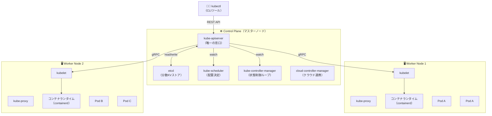

# 5-1. K8s の全体像とアーキテクチャ

## 🎯 このユニットのゴール

- K8s のアーキテクチャ（Control Plane / Node）を説明できる
- 各コンポーネントの役割を詳細に説明できる
- Swarm との違いを整理できる
- 宣言的設定（マニフェスト）の考え方を理解できる
- CRI / CNI の役割を説明できる

---

## シナリオ

> Swarm でオーケストレーションの「感覚」は掴めた。  
> K8s は登場人物が多くて最初は混乱しやすい。  
> Swarm との対比を使いながら、全体像を整理しよう。

---

## 1. K8s とは

**Kubernetes（K8s）** は Google が社内システムで使っていたコンテナ管理の知見（Borg）を OSS として公開したもの。現在は CNCF（Cloud Native Computing Foundation）が管理する。

```
K8s = Ko（K）nai（8文字）s = Kubernetes の略称
```

### K8s が解決する問題

| 問題 | K8s の解決策 |
|---|---|
| コンテナが落ちたら自動で再起動したい | Self-healing（自動復旧） |
| 負荷に応じてコンテナを増減したい | Auto-scaling（HPA） |
| 設定やパスワードを安全に管理したい | ConfigMap / Secret |
| 無停止でバージョンアップしたい | Rolling Update |
| 複数サービスを効率よく複数ホストに配置したい | Scheduler |
| ストレージを Pod 独立に管理したい | PersistentVolume |

### Swarm との対比

| 観点 | Docker Swarm | Kubernetes |
|---|---|---|
| 設定の単位 | Service / Stack | Pod / Deployment / Service など |
| 設定方法 | `docker service create` or yaml | YAML マニフェスト（kubectl apply） |
| 最小実行単位 | タスク（コンテナ 1 つ） | Pod（1 つ以上のコンテナ） |
| ネットワーク | VIP + Routing Mesh | ClusterIP / NodePort / LoadBalancer |
| 設定管理 | Secret のみ | ConfigMap + Secret |
| ストレージ | ボリューム | PersistentVolume / PVC |
| オートスケール | なし（手動） | HPA / VPA |
| コンテナランタイム | runc 固定 | CRI 経由で選択可（containerd / CRI-O） |

---

## 2. K8s のアーキテクチャ



---

## 3. Control Plane の各コンポーネント

### 📖 kube-apiserver

> K8s の **唯一の窓口**。すべての操作（kubectl / 他コンポーネント / 外部ツール）は apiserver を通じて行われる。  
> REST API を提供しており、`kubectl` コマンドはこの API を呼ぶ CLI ツールに過ぎない。

```bash
# kubectl は内部でこういうリクエストを投げている
kubectl get pods
# 内部: GET /api/v1/namespaces/default/pods

kubectl apply -f deployment.yaml
# 内部: POST /apis/apps/v1/namespaces/default/deployments

# API に直接アクセスすることもできる（デバッグ時）
kubectl proxy &   # ローカルの 8001 番を apiserver にプロキシ
curl http://localhost:8001/api/v1/pods
```

**apiserver の特徴：**
- 認証（Authentication）→ 認可（Authorization / RBAC）→ Admission Control の順に通過
- すべての操作はここを通るため、監査ログが一元管理できる
- 水平スケールが可能（複数台で負荷分散）

### 📖 etcd

> K8s の **唯一のデータストア**。クラスタの全状態（どんなリソースが存在するか）がここに保存される。  
> Raft アルゴリズムで冗長化する（Swarm の Manager 合意形成と同じ）。

> **LPIC との接続：**  
> etcd は `/etc` ディレクトリの役割に近い。  
>
> ```
> Linux: /etc/ に設定ファイルが集まる → OS 全体の状態の源泉
> K8s:   etcd に全リソースの状態が集まる → クラスタ全体の状態の源泉
>
> etcd のバックアップ = K8s クラスタのバックアップ（これを守れ）
> ```

```bash
# etcd のバックアップ（実際の本番運用で重要）
ETCDCTL_API=3 etcdctl snapshot save /backup/etcd-snapshot.db \
  --endpoints=https://127.0.0.1:2379 \
  --cacert=/etc/kubernetes/pki/etcd/ca.crt \
  --cert=/etc/kubernetes/pki/etcd/server.crt \
  --key=/etc/kubernetes/pki/etcd/server.key
```

### 📖 kube-scheduler

> 新しく作られた Pod を **どのノードで動かすか**を決める。  
> ノードのリソース量・Affinity 設定・Taint/Toleration などを考慮して配置先を選ぶ。

**スケジューリングのフェーズ：**

1. **Filtering（フィルタリング）**: Pod が配置できないノードを除外
   - リソース不足のノード
   - nodeSelector に合わないノード
   - Taint が合わないノード
2. **Scoring（スコアリング）**: 残ったノードを優先度でランク付け
   - リソースが余っているノードを優先
   - Pod をバランスよく分散

### 📖 kube-controller-manager

> **desired state と現実の差分を埋め続ける**ループ処理。  
> 複数のコントローラーを束ねた 1 つのプロセス。

| コントローラー | 役割 |
|---|---|
| Deployment Controller | ReplicaSet を作成・更新 |
| ReplicaSet Controller | 指定したレプリカ数の Pod を維持 |
| Node Controller | ノードの死活監視 |
| Job Controller | バッチジョブの管理 |
| Service Account Controller | ServiceAccount の自動作成 |

```
Loop（永遠に繰り返す）:
  1. etcd から desired state を読む（"Pod を 3 つ動かしたい"）
  2. 現実の状態を確認（"Pod が 2 つしかない"）
  3. 差分を埋める（"Pod を 1 つ追加 → apiserver に要求"）
  4. 1 に戻る
```

### 📖 cloud-controller-manager

> クラウドプロバイダー（AWS / GCP / Azure）固有の機能を扱うコントローラー。  
> LoadBalancer Service を作ると自動で ELB / ALB が作られるのはここの仕事。

---

## 4. Worker Node の各コンポーネント

### 📖 kubelet

> Node 上で動くエージェント。apiserver から「このノードでこの Pod を起動せよ」という指示を受け取り、実際にコンテナを起動する。  
> 定期的に Pod の状態を apiserver に報告する。

```bash
# kubelet のログを確認（ノード上で）
journalctl -u kubelet -f

# kubelet の設定ファイル
cat /var/lib/kubelet/config.yaml
```

### 📖 kube-proxy

> Node 上でのネットワーク転送ルール（iptables / ipvs）を管理する。  
> Service の ClusterIP への通信を実際の Pod IP に転送する役割。

```bash
# kube-proxy が作った iptables ルールを確認
iptables -t nat -L KUBE-SERVICES
```

### 📖 コンテナランタイム（CRI 経由）

> **CRI（Container Runtime Interface）** — K8s がコンテナランタイムと通信するための標準インターフェース。  
> CRI があるおかげで K8s は特定のランタイムに縛られない。

| ランタイム | 説明 |
|---|---|
| containerd | K8s 1.24 以降の標準。CNCF 卒業プロジェクト |
| CRI-O | OpenShift / Podman のベース。軽量 |
| ~~Docker~~ | K8s 1.24 で非推奨・削除（dockershim 削除） |

---

## 5. CNI（Container Network Interface）

### 📖 用語：CNI

> K8s がコンテナのネットワーク設定を行うためのプラグイン仕様。  
> ネットワークを担当するプラグインを差し替えられる。

| CNI プラグイン | 特徴 |
|---|---|
| Calico | NetworkPolicy 対応・BGP ベース。本番で多く使われる |
| Flannel | シンプルで軽量。小規模向け |
| Cilium | eBPF ベース。可観測性・セキュリティに優れる |
| WeaveNet | 自動暗号化・複数クラスタ対応 |

```bash
# 使用中の CNI を確認（minikube の場合）
kubectl get pods -n kube-system | grep -E "calico|flannel|cilium|weave"

# CNI の設定ファイル（ノード上）
ls /etc/cni/net.d/
```

---

## 6. アドオンコンポーネント

K8s 本体には含まれないが、ほぼ必須のコンポーネント：

| コンポーネント | 役割 |
|---|---|
| CoreDNS | クラスタ内の DNS（サービス名解決） |
| metrics-server | CPU/メモリ使用量の収集（HPA に必要） |
| Ingress Controller | HTTP ルーティング（nginx / Traefik / ALB） |
| Dashboard | Web UI |

```bash
# CoreDNS が動いているか確認
kubectl get pods -n kube-system | grep coredns

# CoreDNS の設定を確認
kubectl get configmap coredns -n kube-system -o yaml
```

---

## 7. 宣言的設定（マニフェスト）

### 命令的 vs 宣言的

```bash
# 命令的（Swarm の docker service create に近い）
kubectl run nginx --image=nginx --replicas=3

# 宣言的（K8s の推奨スタイル）
kubectl apply -f deployment.yaml   # "この状態にしてほしい" と伝えるだけ
```

```yaml
# deployment.yaml（マニフェスト）
apiVersion: apps/v1        # APIのバージョン
kind: Deployment           # リソースの種類
metadata:
  name: nginx              # リソースの名前
  labels:
    app: nginx
spec:
  replicas: 3              # ← "3 台動かしたい" という宣言
  selector:
    matchLabels:
      app: nginx
  template:
    metadata:
      labels:
        app: nginx
    spec:
      containers:
      - name: nginx
        image: nginx:1.25
        resources:
          requests:
            memory: "64Mi"
            cpu: "100m"
          limits:
            memory: "128Mi"
            cpu: "500m"
```

> **宣言的設定の強み：**  
> - `kubectl apply -f` を何度実行しても同じ結果になる（**冪等性**）
> - YAML をバージョン管理（Git）に乗せられる（**Infrastructure as Code**）
> - 「今の状態」と「望む状態」の差分だけを適用してくれる
> - チームで「インフラの状態」を共有できる

> **LPIC との接続：**  
> `/etc/network/interfaces` や `/etc/fstab` に近い発想。  
>
> ```
> /etc/fstab:
>   /dev/sdb1 /data ext4 defaults 0 0
>   → "起動時に /dev/sdb1 を /data にマウントせよ" という宣言
>   → 何度 mount -a を実行しても同じ結果
>
> K8s マニフェスト:
>   replicas: 3
>   → "nginx を 3 台動かせ" という宣言
>   → 何度 kubectl apply しても同じ結果（冪等）
> ```

---

## ✅ 振り返りチェックリスト

- [ ] Control Plane の 5 つのコンポーネントと役割を説明できる
- [ ] kubelet が「apiserver → コンテナ起動」の橋渡し役であることを説明できる
- [ ] etcd が「K8s の /etc」であることを説明できる
- [ ] 宣言的設定と命令的設定の違いを説明できる
- [ ] controller manager の「ループで差分を埋め続ける」動作を説明できる
- [ ] CRI と CNI の役割（ランタイムとネットワークの抽象化）を説明できる
- [ ] containerd が K8s 1.24 以降の標準 CRI であることを説明できる

---

## 次のユニット

[5-2. ローカル環境構築と kubectl](./5-2_local-setup.md)
